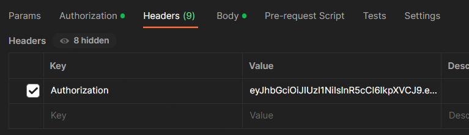

Documentation

Endpoint list :

# authentication

- /auth/login (POST)
- /auth/register (POST)

# todo

- /todo/create (POST)
- /todo/all (GET)
- /todo/:id (GET)
- /todo/:id (PUT)
- /todo/:id (DELETE)
- /todo/all (DELETE)

## END POINT DOCUMENTATION

# /auth/login (POST)

body :
{
"username": "frinsen",
"password": "12345678"
}

- hasil response akan berupa token, dan jangan lupa untuk memasukkan token di header dengan menggunakan key "Authorization"

# /auth/register (POST)

body :
{
"username": "frinsen",
"password": "12345678"
}

- hasil response akan berupa token, dan jangan lupa untuk memasukkan token di header dengan menggunakan key "Authorization"

## UNTUK MENGGUNAKAN FUNGSI SELURUH TODO, HARUS MELAKUKAN HAL INI UNTUK AUTHORIZATION

- masukkan token di header dengan menggunakan key "Authorization"
  

# /todo/create (POST)

body :
{
"title": "todo 1",
"description": "belajar express",
}

# /todo/all (GET) (TANPA MENGGUNAKAN BODY)

# /todo/:id (GET) (UBAH ENPOINT ID MENJADI TODO ID (misal "/todo/1"))

# /todo/:id (PUT) (CONTOH ENDPOINT "/todo/1" dengan method PUT)

body :
{
"title": "todo 4444 update",
"description": "belajar express"
}

# /todo/:id (DELETE) (TANPA MENGGUNAKAN BODY) (CONTOH ENDPOINT "/todo/1" dengan method DELETE)
